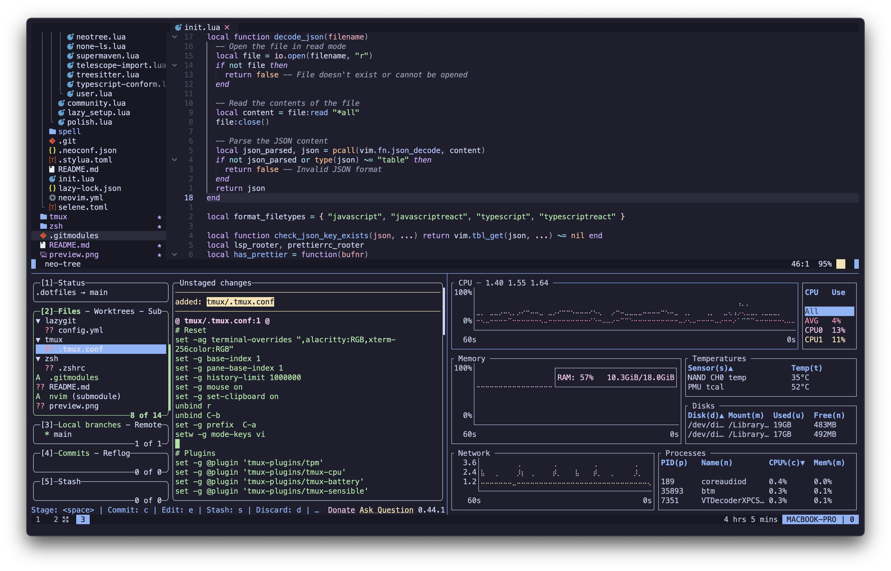

# Dotfiles

This repository contains my personal configuration files (dotfiles) for various tools and utilities. It serves as a way to easily set up and synchronize my development environment across multiple machines.
